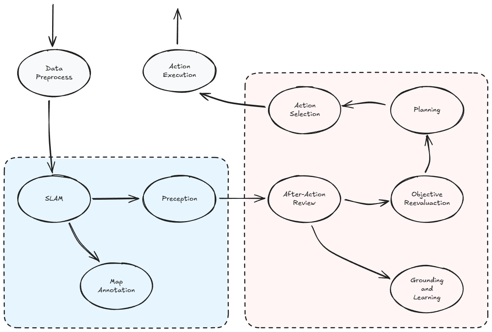
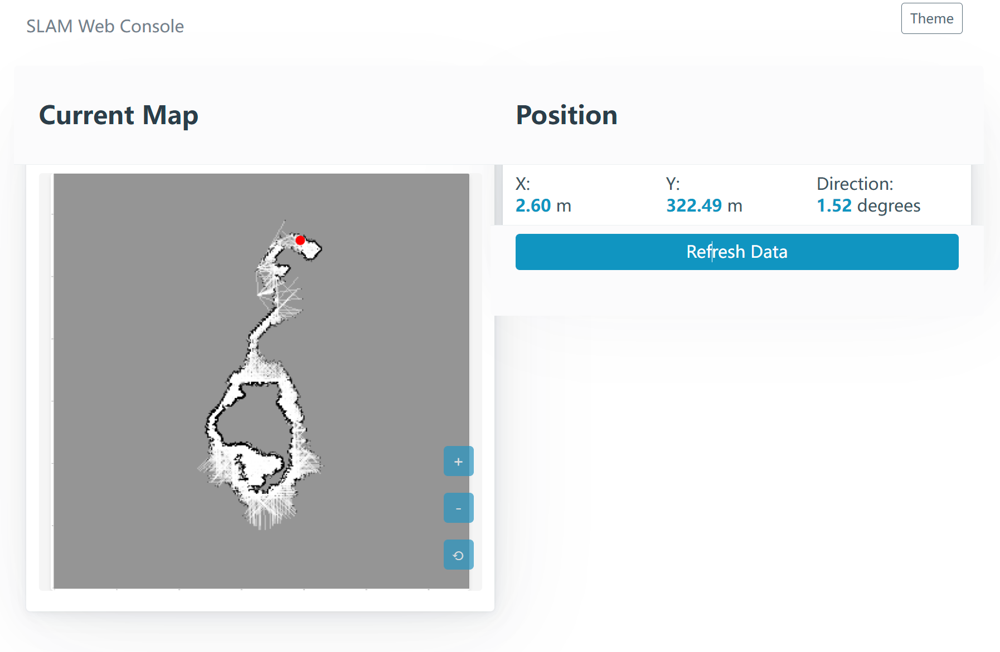

# Miner/Agent Development 🤖

---

## Junior Agent

The `JuniorAgent` is a naive implementation of the ReAct paradigm and an ephemeral memory system.

## Senior Agent

The `SeniorAgent` provides a modular framework for architecting general-purpose AI agents with integrated navigation and cognitive capabilities.



The code in `action_execution` also exemplifies the integration of local and remote function calls to extend agent capabilities, demonstrating a hybrid execution paradigm.

### Installation

`SeniorAgent` introduces extra dependencies. Install with `uv`:

```
uv sync --extra miner
uv pip install -e .
```

### SLAM

Two algorithm approaches are provided to demonstrate SLAM integration with sensor data in the Synapse:

* FastSLAM
* ISAM

And a simple web page to visualize the SLAM status:

```
python eastworld/miner/slam/console.py --port 5000
```



### Memory

The `JSONFileMemory` class persists agent memory data in JSON format to a `memory.json` file within the working directory by default. For production deployments, we recommend implementing alternative storage backends like SQLite or other persistent database solutions.

### LLM Provider

While `SeniorAgent` employs the generic OpenAI SDK for LLM calls and is theoretically model-agnostic, the current implementation specifically utilizes the Gemini 2.0 model (selected for its notable inference speed). Note that prompt engineering is optimized for Gemini's architecture, and modifying the LLM provider requires a little code adjustments, such as adjusting hard-coded model names.


---

In the competitive world of Bittensor subnets, we understand that miners may be reluctant to share their success strategies. However, we still encourage you to post your ideas, experiences, and breakthroughs to the community. The technology behind general AI agents (or embodied agent, generally-capable agent) is in its early stages. Open discussion and collaboration are key to accelerating progress, and will ultimately benefit everyone in the long run. Eastworld subnet will maintain continuous evolution through periodic integration of cutting-edge research advancements.